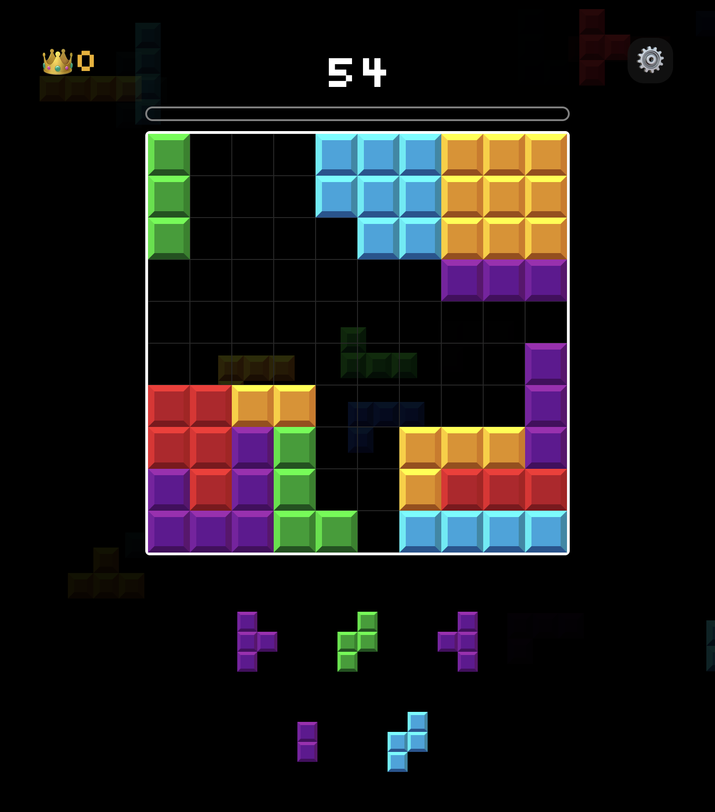
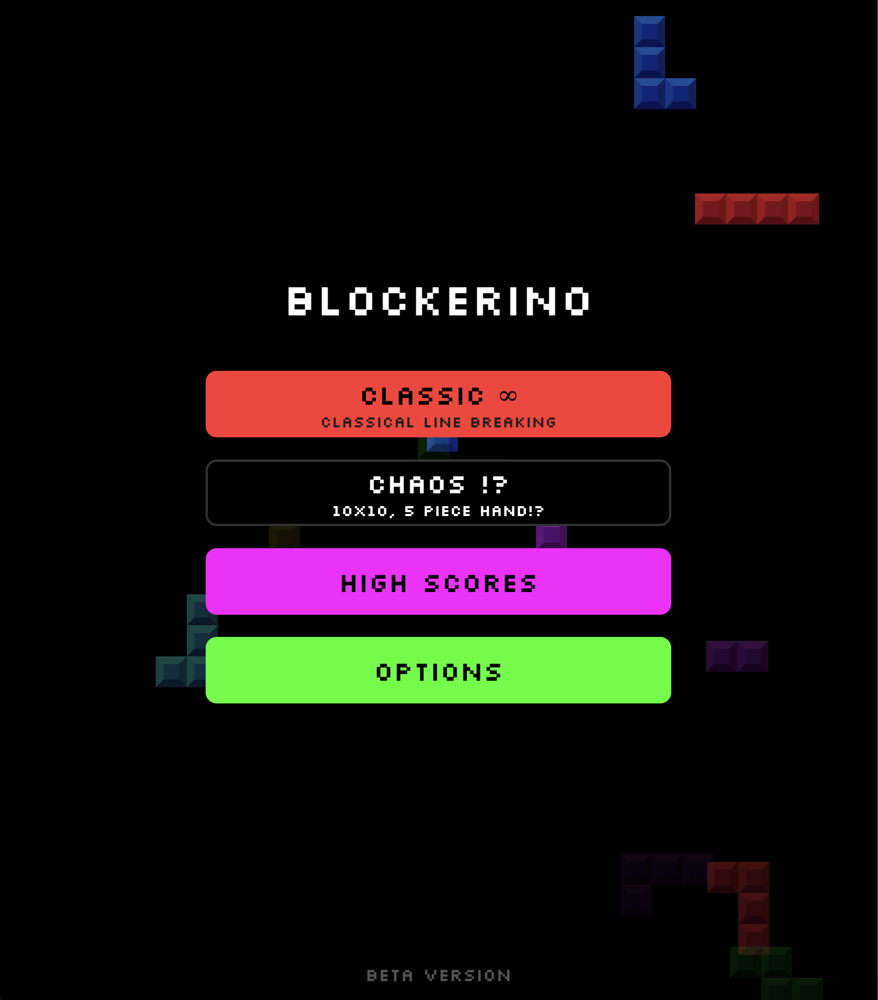

# construct-blast
Web and mobile Block Blast-style puzzle game. Place blocks, break lines, and chase a global leaderboard.

#### In-game screenshot
</img>
</img>

### Installation
1. Install dependencies
```bash
npm install
```
2. Run the dev server
```bash
npm start
```
construct-blast uses Expo - you can use Expo Go, emulators, or the web to run.
